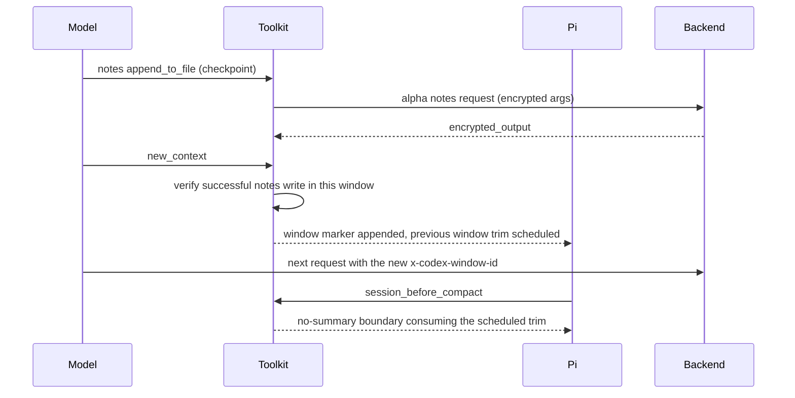

# Toolkit Internals

Developer-facing reference for [pi-openai-toolkit](../README.md). This is the protocol and implementation detail that the README deliberately keeps out of the user's way. If you are only installing the toolkit, you never need this page; if you are changing wire behavior, fixtures, or the compaction strategy code, start here.

## Table of Contents

- [Remote Context protocol](#remote-context-protocol)
- [Rollover lifecycle](#rollover-lifecycle)
- [Remote Compaction v2 wire contract](#remote-compaction-v2-wire-contract)
- [Artifacts and debugging](#artifacts-and-debugging)
- [Provenance](#provenance)

## Remote Context protocol

Internal alpha endpoints, adapted from `@howaboua/pi-codex-conversion`:

```text
POST {base}/alpha/history/v2/list_windows | list_items | read_item | search_contents
POST {base}/alpha/notes/v2/list_files_by_prefix | read_file | search_contents | append_to_file | write_file
GET  {base}/alpha/notes/v2/thread_hint
```

Native route uses `{base} = <backend-api>/codex` with `Authorization: Bearer <oauth token>`, `ChatGPT-Account-ID`, and Codex CLI headers. Gateway route uses the configured `/v1` base with the data-plane API key, `originator: codex_cli_rs`, `X-Codex-Affinity-Scope`, and `X-Codex-Model` carrying the bare model id, never local credentials. Both set `Session-Id` / `X-Client-Request-Id` to the bounded Pi session id, `x-openai-tool-output-truncation-policy`, and `x-openai-encrypted-tool-arguments` for endpoints with encrypted parameters; encrypted results come back as `encrypted_output` and are re-encoded into later requests. These are alpha contracts: the upstream backend may change them at any time.

Search text and note bodies are sent under the encrypted-argument policy. Live model requests carry `x-codex-window-id` and `x-codex-turn-metadata` request headers derived from the active window identity.

Coverage is never inferred from model names. A native session is `provider: "openai-codex"` on api `openai-codex-responses` (any model id). A gateway session must be on api `openai-responses` and carry an exact `provider/model` key listed in `compaction.gatewayContextModels`; the list ships empty and there is no built-in gateway SKU ([src/context-management/codex-provider.ts](../src/context-management/codex-provider.ts)). Unlisted gateway models, listed or not, keep running remote compaction v2 when Remote Context declines them. The toolkit registers no provider or model with Pi; it resolves credentials and base URLs through Pi's `ModelRegistry`.

## Rollover lifecycle

The `new_context` happy path, end to end:



State invariants the lifecycle code must keep honest:

- The checkpoint gate verifies a *successful* `notes` `append_to_file` / `write_file` against the persisted session branch after the latest window boundary, so it survives restarts and forks.
- Budget checks are skipped until the current window has produced its own assistant usage; acting on the previous window's usage anchor burns the once-per-window reminder on a false alarm.
- The scheduled trim is consumed exactly once, synchronously, by the first compaction attempt whose boundary window id matches. Every other compaction path (threshold without a scheduled rollover, manual `/compact`, overflow) is cancelled.
- A window boundary is persisted as a `codex-context-window` custom message; `session_start` replays boundaries from the branch and rebuilds identity after forks.

## Remote Compaction v2 wire contract

A `compaction_trigger` item appended to the live streaming request yields one output item of `type: "compaction"` with non-empty `encrypted_content`, stored in `CompactionEntry.details.compactedWindow`. On later requests the opaque checkpoint is replayed ahead of live turns: zero-loss, no text summary. Replay fails closed: if the summary anchor cannot be located, the request is aborted with a notification and a content-free failure artifact; the sentinel-only payload is never sent. A v2 response with a missing or empty checkpoint is never stored, and the `nativeFallback` tier is skipped: Pi's own threshold drives the next attempt, which may use `remoteCompactModel` when configured. `remoteCompactModel` must resolve to the same effective base URL as the active model.

## Artifacts and debugging

With `debug: true` the toolkit writes lifecycle and compaction artifacts under `artifactRoot` (default `~/.pi/agent/artifacts/pi-openai-toolkit/compaction`):

- each `session_start` writes a lifecycle artifact whose `activation` field records `active`, or the exact inactive reason (`tool-name-conflict`, `missing-api-key`, `auth-resolution-failed`, `model-not-covered`, ...);
- `logProviderPayloads` additionally writes raw provider request payloads, `logCompactResponses` the compact SSE bodies; keep both off unless inspecting a specific request;
- artifacts always redact Authorization credentials, API keys/tokens, Codex account ids, and opaque `encrypted_content` / `encrypted_output`, even with `redactSensitiveData: false`.

## Provenance

The Remote Context protocol was reverse-engineered from `@howaboua/pi-codex-conversion@3.0.29` (source commit `7021ae48e8efe36a3becc5830d529696ff798e5e`). The Astra compatibility layer is adapted from Oh My Pi 18.1.8 (MIT). Web Search behavior was adapted from [`pi-openai-web-search`](https://github.com/code-yeongyu/pi-openai-web-search) (commit `3964338`). Attribution details are in [NOTICE](../NOTICE).

Protocol fixtures live in [src/context-management/](../src/context-management/) and must be updated together with any upstream alpha endpoint change; fixture-based tests are required for new wire behavior.
